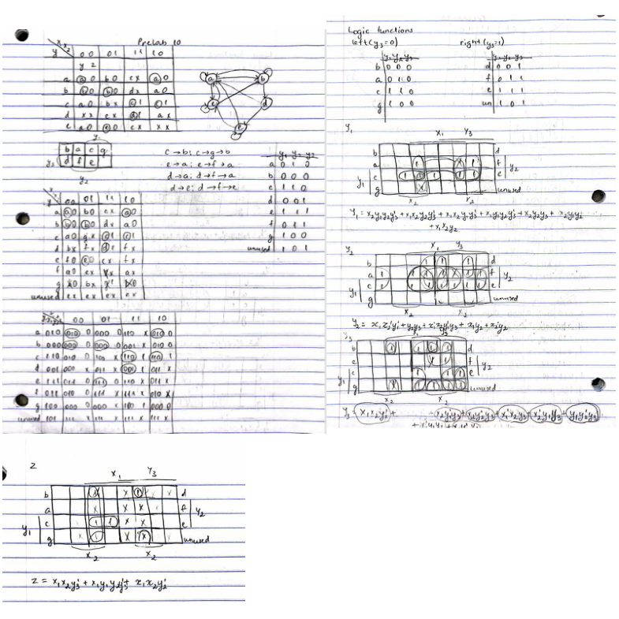
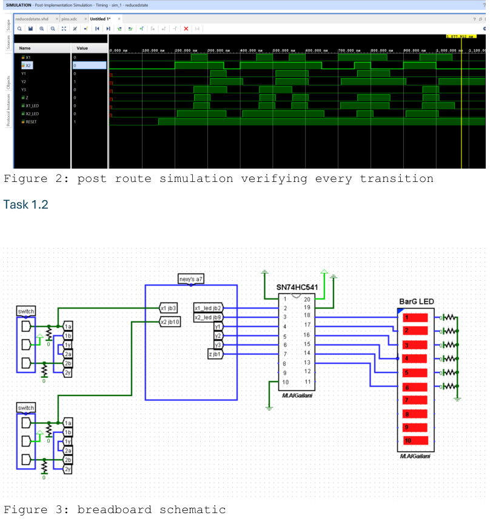
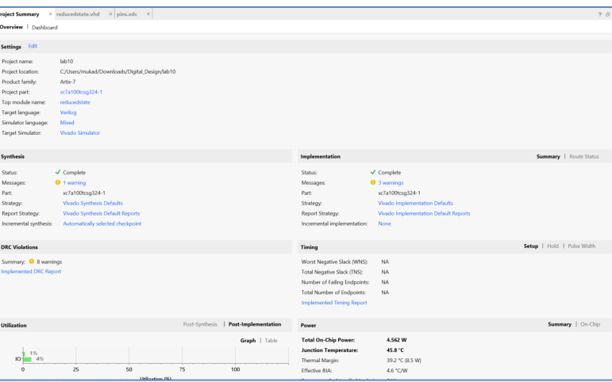
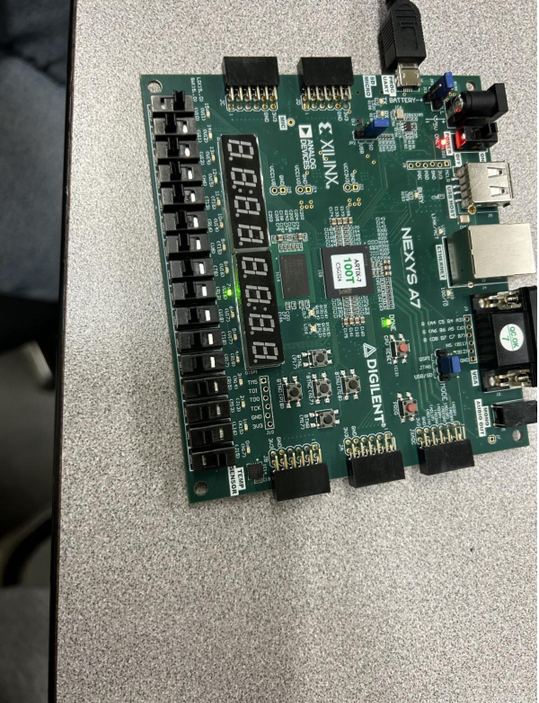
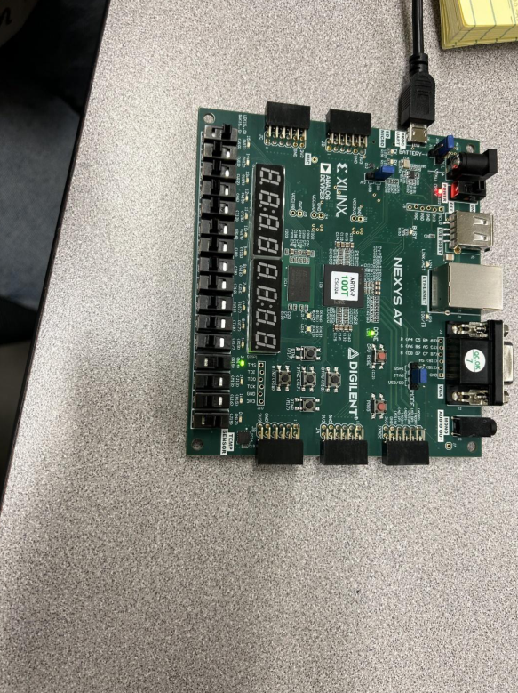
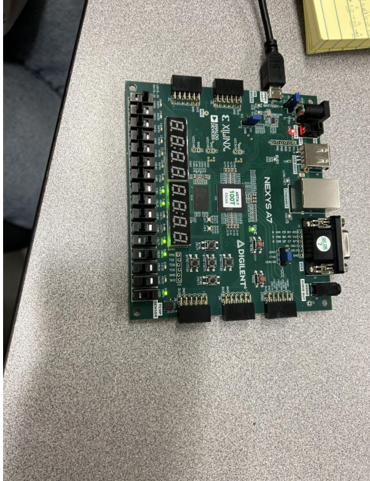
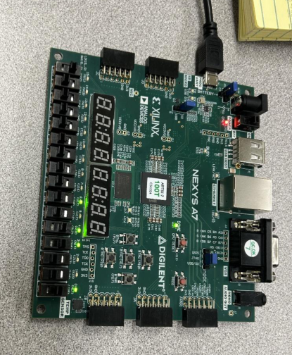

# Asynchronous Sequential Circuit (Critical Race‑Free Design)

This lab was about doing an **asynchronous sequential circuit** without it glitching itself into the wrong state.
We started from a reduced state table, made a **critical race‑free state assignment**, derived **next‑state equations** (K‑maps), then verified the state transitions in **post‑route simulation** and on real Nexys A7 hardware.

---

## Repo description (GitHub description box)

Asynchronous sequential circuit in VHDL with a critical race‑free state assignment, K‑map derived next‑state equations, post‑route simulation verification, and FPGA hardware validation across all state transitions.

---

## What’s in here

- Race‑free assignment + K‑maps (the “why this doesn’t race” part)
- VHDL implementation of the next‑state equations (`Y1`, `Y2`, `Y3`) and output `Z`
- Post‑route sim showing every transition
- Breadboard schematic + hardware photos confirming stable states

---
---

## Design overview

Inputs:
- `X1`, `X2` — drive transitions
- `RESET` — gates the logic (active-low in the test script)

State (stored via feedback):
- `Y1`, `Y2`, `Y3` — implemented as combinational feedback loops (so the XDC allows combinational loops)

Output:
- `Z` — function of inputs + current state

---

## Race‑free assignment + K‑maps



---

## Post‑route simulation + breadboard schematic

This page includes both:
- the post‑route waveform verifying transitions, and
- the wiring diagram used for the Nexys A7 + LED bar setup.



---

## Vivado implementation summary



---

## Hardware validation (states a → e)

These photos are the “proof it lands where it should” shots.







---

## Code snippets (from the appendix)

### VHDL: next‑state equations + output

```vhdl
Y1 <= ((x2 and y1 and y2 and not(y3))
 or (x1 and x2 and y2 and not(y3))
 or (x1 and x2 and y1 and not(y3))
 or (x1 and y1 and y2 and not(y3))
 or (x2 and y2 and y3)
 or (x2 and y1 and y2)
 or (x1 and x2 and y2)) and reset;

Y2 <= ((x1 and not(x2) and not(y1))
 or (not(x1) and x2 and not(y1) and y3)
 or (y2 and y3)
 or (x1 and y2)
 or (not(x2) and y2)) and reset;

Y3 <= ((x1 and x2 and not(y2))
 or (x2 and not(y1) and y3)
 or (x2 and not(y2) and y3)
 or (not(x1) and x2 and y3)
 or (not(x2) and y1 and y3)
 or (y1 and not(y2) and y3)
 or (not(x1) and y1 and y3)
 or (x1 and not(y2) and y3)) and reset;

Z <= (x1 and x2 and not(y3))
 or (x1 and y1 and y2 and not(y3))
 or (x1 and x2 and not(y2));
```

### XDC: allow combinational feedback loops

```tcl
set_property ALLOW_COMBINATORIAL_LOOPS TRUE [get_nets Y1*];
set_property ALLOW_COMBINATORIAL_LOOPS TRUE [get_nets Y2*];
set_property ALLOW_COMBINATORIAL_LOOPS TRUE [get_nets Y3*];
```

### Tcl: transition test sequence (example)

```tcl
restart
add_force RESET {0 0ns}
add_force X1 {0 0ns}
add_force X2 {0 0ns}
run 150ns

add_force RESET {1 0ns}
run 50ns
add_force X2 {1 0ns}   ;# go to b
run 50ns
add_force X1 {1 0ns}   ;# go to d
run 50ns
add_force X1 {0 0ns}   ;# go to e
run 50ns
add_force X2 {0 0ns}   ;# go to a
run 50ns
```

---

## Run it (Vivado)

1. Create a Vivado project targeting **Nexys A7**.
2. Add `src/reducedstate.vhd`.
3. Add the `.xdc` (keep the combinational-loop allow rules).
4. Run post‑route timing simulation and `source sim/reducedstate_forces.tcl`.
5. Program the FPGA and confirm the LEDs match the documented states.

---

## Report

See `report/ECE 4525 lab 10 report.pdf` for the full write-up, screenshots, and appendix code.
